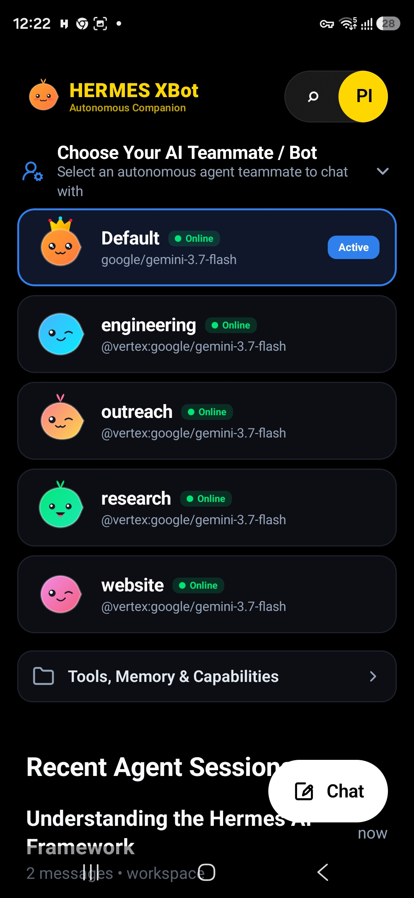
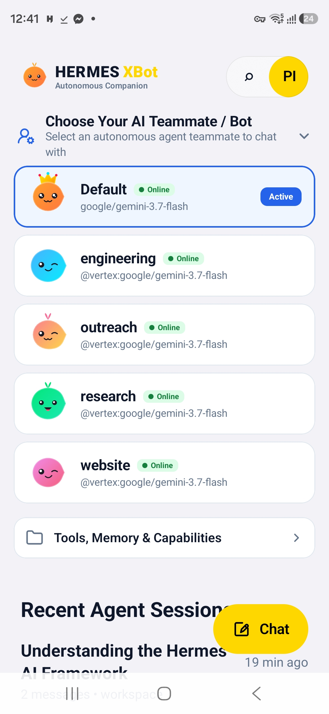

# 🤖 Hermes XBot — Autonomous AI Teammates & Cockpit for Android

[](https://android.com)
[](LICENSE)
[](https://hermes-agent.nousresearch.com)
[]()

**Hermes XBot** is a native Android companion and autonomous teammate cockpit for [Hermes Agent](https://hermes-agent.nousresearch.com) and `hermes-webui`. Designed as an autonomous AI teammate cockpit, it puts your specialized AI agents (Engineering, Research, DevOps, Outreach) front-and-center as distinct, interactive teammates with real-time tool telemetry and background task handoffs.

> ℹ️ **Attribution**: Hermes XBot is proudly built upon the foundational open-source architecture and API contracts of [**Hermex**](https://github.com/uzairansaruzi/hermex) (by Uzair Ansar) and the [**hermex-android-port**](https://github.com/Hungbocluaqua/hermex-android-port). We express our gratitude to the upstream authors for establishing the mobile REST + SSE foundations.

---

## 📥 Download APK (Free & Direct)

You can download and install the pre-built APK directly:

* 🚀 **[Download Latest APK (`HermesXBot-latest.apk`)](https://github.com/deggimatt/hermes-xbot/raw/main/release/HermesXBot-latest.apk)**
* 📦 **[GitHub Releases Page](https://github.com/deggimatt/hermes-xbot/releases)**

---

## 📱 Screenshots

<div align="center">
  
  &nbsp;&nbsp;&nbsp;&nbsp;
  
</div>

---

## ✨ Key Features

### 1. 🤖 AI Teammates Hub (Hero Centerpiece)
- **Front & Center Agent Selector**: Choose immediately which autonomous agent teammate to chat with (*Default*, *Engineering*, *Research*, *Outreach*, *DevOps*).
- **Cute 2D Cartoonish Blob Avatars**: Every agent gets a uniquely autogenerated 2D blob character with glossy eyes, rosy blush, and distinct expressions.
- **👑 Royal Crown for Default Agent**: The `Default` bot avatar wears a golden royal jeweled crown by default.
- **Live Status Indicator**: Real-time `● Online` / `● Idle` badges for active agents.

### 2. ⚡ Real-Time SSE Stream & Tool Telemetry
- **Server-Sent Events (SSE)**: Ultra-smooth, non-blocking token streaming with automatic resume and replay cursor.
- **Collapsible Tool Activity Cards**: Monospace terminal output, Git diffs, browser previews, and Python execution traces.
- **Interactive Turn Approvals**: One-tap approval prompts (`POST /api/pending/respond`) for dangerous commands and dynamic multi-select clarifying questions.

### 3. 🎙️ Mobile-First Integrations
- **Push-to-Talk Voice Dispatch**: Record voice notes with waveform feedback and instant server transcription (`POST /api/transcribe`) + TTS audio playback.
- **Android Share Target**: Share URLs, text, or photos from Chrome, Twitter/X, and file managers straight into an active session.
- **Background Stream Resilience**: Foreground sync service ensures streaming tasks continue uninterrupted when the screen is locked.

### 4. 🎨 Modern Adaptive UI & OLED Themes
- **OLED Pitch Black & Slate Cards** in Dark Mode (`#000000` / `#0C0E14` with electric blue `#2F80ED` accents).
- **Crisp Slate & Pure White Surfaces** in Light Mode (`#FFFFFF` with `#E2E8F0` borders).
- **Dynamic Header Logo Color Tinting**: The `HERMES XBot` top typography dynamically adopts your customized accent color from Settings.
- **Clean Text-Only Session History**: Distraction-free recent conversation list.

### 5. 🧠 Offline Storage & Extended Workspaces
- **Room Database**: Complete offline caching of sessions, messages, and projects with server-ownership indexing.
- **Encrypted Keystore**: Hardware-backed credential and token storage.
- **Panels**: Persistent Mnemosyne memory viewer, Scheduled Cron task manager, and Autonomous Kanban mission board.

---

## 🚀 Quick Start & Connection

1. **Start your Hermes Server**:
   ```bash
   hermes dashboard --host 0.0.0.0 --port 8787
   ```
2. **Install the APK on Android**:
   ```bash
   adb install release/HermesXBot-latest.apk
   ```
3. **Connect**:
   - Open **Hermes XBot** on your Android device.
   - Enter your server address (e.g. `https://hermes.yourdomain.com` or your Tailscale IP `http://100.x.y.z:8787`).
   - Enter your `HERMES_WEBUI_PASSWORD` (if configured) and tap **Connect**.

---

## 🛠️ Building from Source

### Prerequisites
- JDK 17 or JDK 21
- Android SDK Platform 36 (Build Tools 36.0.0)
- Gradle 8.11+ / AGP 9.2+

```bash
# Clone the repository
git clone https://github.com/deggimatt/hermes-xbot.git
cd hermes-xbot/android

# Run unit tests
./gradlew testDebugUnitTest

# Assemble Debug APK
./gradlew assembleDebug
```
The compiled APK will be at `android/app/build/outputs/apk/debug/app-debug.apk`.

---

## 📄 License & Attribution

This project is licensed under the **MIT License** — see the [LICENSE](LICENSE) file for details.

* **Upstream Attribution**: Based on [Hermex](https://github.com/uzairansaruzi/hermex) by Uzair Ansar and [hermex-android-port](https://github.com/Hungbocluaqua/hermex-android-port).
* **Hermes Agent**: Developed by [Nous Research](https://github.com/NousResearch/hermes-agent).
